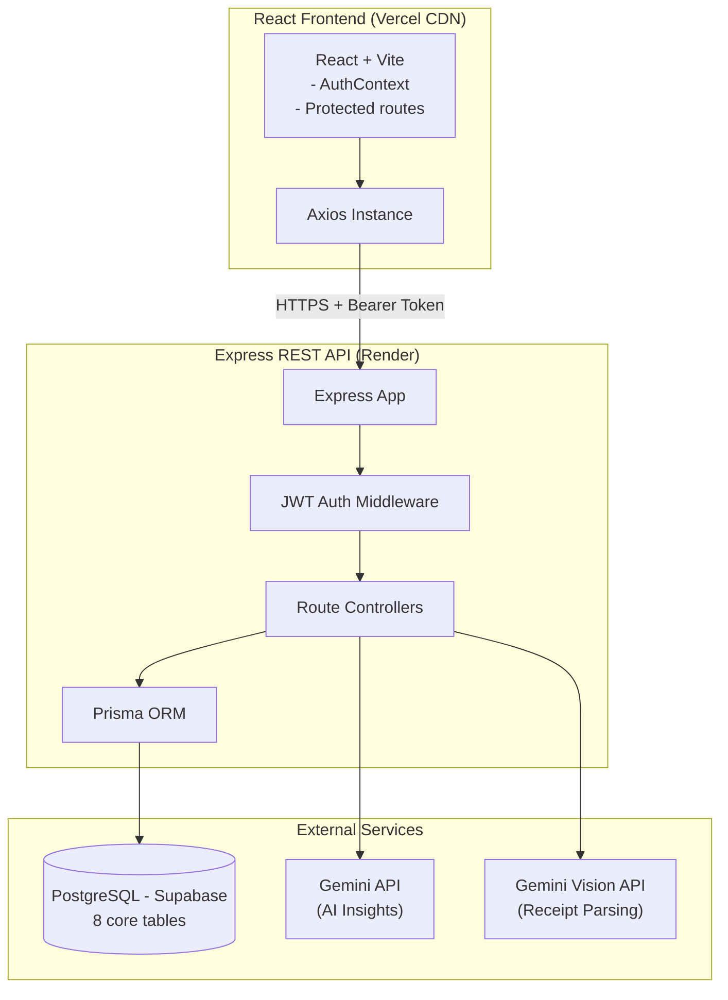

# EquiFlow

> Group expense management platform with smart debt reconciliation and AI-powered features

[](https://equiflow.vercel.app)
[](https://equiflow-server.onrender.com)

EquiFlow is a full-stack collaborative expense splitting application. Groups of users can track shared expenses, split bills equally, by custom amounts, or by percentage, and settle debts using a greedy minimization algorithm that reduces the number of transactions needed to clear all balances. AI-powered features include intelligent receipt scanning using Gemini Vision to auto-extract expense details from photos, and personalised spending insights that analyse spending patterns to highlight useful trends and observations.

---

## Live Demo

🔗 [equiflow.vercel.app](https://equiflow.vercel.app)

Test credentials if you don't want to register:
```
Email:    demo@equiflow.app
Password: DemoUser@123
```

---

## Key Features

- **Group expense tracking** - Create groups, add members by email, track shared costs
- **Three split modes** - Equal, custom amount, or percentage per member
- **Smart debt minimization** - Greedy algorithm reduces N debts to minimum transactions
- **Ledger-based settlements** - Settlements recorded as financial events, not mutations of split rows
- **AI spending insights** - Gemini API analyses monthly patterns and generates plain-language observations
- **Receipt scanning** - Upload a receipt image; Gemini Vision extracts amount, merchant, and category
- **Auto-categorisation** - Keyword matching pre-selects expense category as user types
- **Analytics** - Spending by category charts and monthly trend visualisation per group and overall
- **Notifications** - In-app bell with unread count for expense additions, settlements, and group joins
- **JWT authentication** - Stateless auth with protected routes on both frontend and backend

---

## Tech Stack

**Frontend**
- React 19 + Vite
- React Router v7
- Tailwind CSS
- Recharts
- Axios
- react-hot-toast

**Backend**
- Node.js + Express 5
- Prisma ORM
- PostgreSQL (Supabase)
- JSON Web Tokens
- bcryptjs
- Google Gemini API (`gemini-1.5-flash`)

**Infrastructure**
- Frontend → Vercel
- Backend → Render
- Database → Supabase (PostgreSQL)

---

## Architecture



**Database Schema** - 8 models: `User`, `Group`, `GroupMember`, `Expense`, `ExpenseSplit`, `Settlement`, `Category`, `Notification`

**Settlement Architecture** - Settlements are recorded as ledger entries (financial events) rather than mutating individual `ExpenseSplit` rows. This correctly handles debt minimization where the payer and receiver may have no direct shared expense.

---

## Key Technical Decisions

### Greedy Debt Minimization Algorithm
Rather than tracking individual pairwise debts, the app calculates each member's net balance across all expenses, then uses a two-pointer greedy approach to match debtors with creditors. This reduces N debts to at most N-1 transactions, which is the theoretical minimum.

### Ledger-Based Settlement System
Early implementation marked individual `ExpenseSplit` rows as paid during settlement. This broke when debt minimization created virtual payment paths (e.g. C pays A, even though C never shared an expense directly with A). The fix: treat settlements as independent financial events that adjust the balance map. The balance calculation becomes: `current balance = net expense obligations ± settlement adjustments`.

### Parallel Data Fetching
Pages that require multiple API calls use `Promise.all` to fire all requests simultaneously. The Group Detail page fetches group info, expenses, balances, and settlement history in parallel, so total load time equals the slowest single request rather than the sum of all.

### AI Receipt Parsing
Receipt images are converted to base64 on the frontend, sent to the backend (which holds the API key), and forwarded to Gemini Vision with a structured JSON prompt. The backend validates the response shape before returning, and fails gracefully to manual input if Gemini cannot read the image.

---

## Local Setup

### Prerequisites
- Node.js 18+
- PostgreSQL database (or Supabase account)

### 1. Clone and install

```bash
git clone https://github.com/AbhishekRai456/equiflow.git
cd equiflow

# Install server dependencies
cd server && npm install

# Install client dependencies
cd ../client && npm install
```

### 2. Configure environment variables

**`server/.env`**
```
DATABASE_URL=postgresql://...
JWT_SECRET=your_jwt_secret_here
GEMINI_API_KEY=your_gemini_key_here
CLIENT_URL=http://localhost:5173
PORT=5000
```

**`client/.env.local`**
```
VITE_API_URL=http://localhost:5000/api
```

### 3. Set up the database

```bash
cd server
npx prisma migrate dev
npx prisma db seed
```

### 4. Run

```bash
# Terminal 1 — backend
cd server && npm run dev

# Terminal 2 — frontend
cd client && npm run dev
```

App runs at `http://localhost:5173`

---

## API Overview

| Method | Endpoint | Description |
|--------|----------|-------------|
| POST | `/api/auth/register` | Register new user |
| POST | `/api/auth/login` | Login, returns JWT |
| GET | `/api/groups` | Get user's groups |
| POST | `/api/groups` | Create group |
| GET | `/api/groups/:id` | Group detail + members |
| POST | `/api/groups/:id/expenses` | Add expense (equal/custom/percentage) |
| GET | `/api/groups/:id/balances` | Calculated balances + suggested settlements |
| POST | `/api/groups/:id/settlements` | Record settlement |
| GET | `/api/groups/:id/analytics` | Spending by category + monthly trend |
| GET | `/api/dashboard` | User's overall balance summary |
| GET | `/api/insights` | AI-generated spending insights |
| POST | `/api/receipts/parse` | Extract expense data from receipt image |
| GET | `/api/notifications` | User's notifications |

---

## Project Structure

```
equiflow/
├── client/                 # React frontend
│   ├── src/
│   │   ├── api/            # All the Axios requests to the backend
│   │   ├── components/     # Reusable UI components
│   │   ├── context/        # AuthContext
│   │   └── pages/          # Full page views
│   ├── vercel.json         # SPA routing config for production
│   └── vite.config.js
│
└── server/                 # Express backend
    ├── controllers/        # Request handling logic
    ├── middleware/         # Auth middleware
    ├── routes/             # Express routers (API Endpoints)
    └── prisma/
        ├── client.js       # Prisma client singleton
        ├── schema.prisma   # Database schema
        └── seed.js
```

## License

MIT